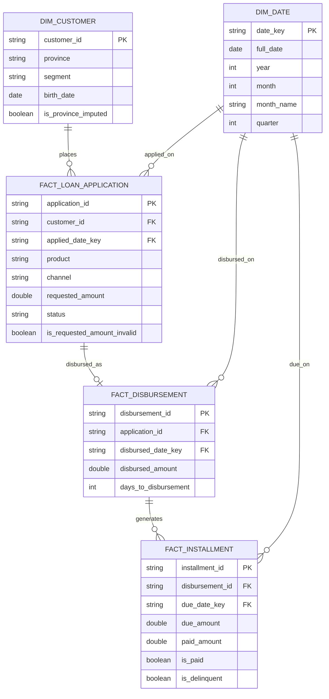
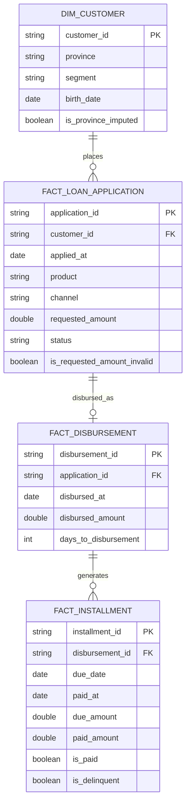

# Session Log — Credicuotas Data Engineer Challenge

Bitácora completa de la sesión de trabajo con Claude durante la resolución
del challenge. Documenta, en orden cronológico, cada decisión técnica, cada
problema de entorno resuelto, y el código/SQL/tests que se fueron
construyendo capa por capa (bronze → silver → gold).

> **Nota:** este documento es un resumen técnico organizado de la
> conversación completa, no una transcripción literal mensaje por mensaje —
> se priorizó que quede legible y navegable en GitHub, preservando el
> detalle de cada decisión, código y resultado.

## Índice

1. [Contexto inicial y setup de Docker Desktop + WSL2](#1-contexto-inicial-y-setup-de-docker-desktop--wsl2)
2. [Revisión de la estructura del challenge](#2-revisión-de-la-estructura-del-challenge)
3. [Troubleshooting del entorno (WSL2, Docker, permisos)](#3-troubleshooting-del-entorno-wsl2-docker-permisos)
4. [Perfilado de calidad de datos (bronze)](#4-perfilado-de-calidad-de-datos-bronze)
5. [Diseño e implementación de la capa silver](#5-diseño-e-implementación-de-la-capa-silver)
6. [Decisión de negocio: PENDING en Approval Rate](#6-decisión-de-negocio-pending-en-approval-rate)
7. [Modelo dimensional — versión 1](#7-modelo-dimensional--versión-1)
8. [Refinamiento del modelo (date_trunc, staging view, delinquency)](#8-refinamiento-del-modelo-date_trunc-staging-view-delinquency)
9. [Modelo dimensional — versión final](#9-modelo-dimensional--versión-final)
10. [SQL de las 3 métricas](#10-sql-de-las-3-métricas)
11. [Implementación de la capa gold + tests](#11-implementación-de-la-capa-gold--tests)
12. [Revisión de outputs y fix de bug](#12-revisión-de-outputs-y-fix-de-bug)
13. [Entrega de paquetes y troubleshooting final](#13-entrega-de-paquetes-y-troubleshooting-final)
14. [Write-up final](#14-write-up-final)

---

## 1. Contexto inicial y setup de Docker Desktop + WSL2

El usuario compartió la estructura del repo del challenge (`data/`, `src/`,
`Dockerfile`, `Makefile`, `docker-compose.yml`, `requirements.md`) y pidió
una guía para levantarlo desde cero en Docker Desktop en Windows con WSL2.

Se explicó el flujo general:

```bash
git clone <repo>
cd <repo>
# revisar README.md / SETUP.md
# revisar Dockerfile, docker-compose.yml, Makefile
docker compose build
docker compose up -d
```

## 2. Revisión de la estructura del challenge

Se subió el zip completo (`credicuotas-data-engineer.zip`) y se inspeccionó
archivo por archivo:

- **`README.md`** — brief general de Braintly, contacto de la reclutadora.
- **`Dockerfile`** — `python:3.11-slim` + JDK (necesario porque PySpark
  corre sobre la JVM) + `pip install -r requirements.txt`.
- **`docker-compose.yml`** — un solo servicio `pipeline`, monta `.:/app`
  como volumen, expone el puerto `4040` (Spark UI).
- **`Makefile`** — targets `build`, `run`, `shell`, `data`, `clean`.
- **`requirements.txt`** — `pyspark==3.5.1`.
- **`src/pipeline.py`** — scaffold con `bronze()` implementado y `silver()`
  / `gold()` como `NotImplementedError`.
- **`data/`** — 4 CSVs: `customers.csv`, `loan_applications.csv`,
  `disbursements.csv`, `installments.csv`.

**Hallazgo clave:** `Dockerfile.txt` y `Makefile.txt` habían quedado con
extensión `.txt` de más al descomprimir en Windows — había que renombrarlos
a `Dockerfile` y `Makefile` (sin extensión) para que `docker compose build`
y `make` los reconocieran.

## 3. Troubleshooting del entorno (WSL2, Docker, permisos)

Una serie de problemas típicos de setup en Windows, resueltos en orden:

| Problema | Causa | Solución |
|---|---|---|
| `make : El término 'make' no se reconoce` | Se ejecutaba desde PowerShell nativo, no desde WSL2 | Entrar con `wsl -d Ubuntu` |
| `cp: can't stat '/mnt/c/Users/mauro/...'` | El `wsl` sin distro específica entró a la distro interna de Docker Desktop (`/mnt/host/c/...`), no a una distro de usuario | Instalar Ubuntu con `wsl --install -d Ubuntu` |
| `sudo: Authentication failed` | Contraseña de usuario olvidada/nunca configurada | `wsl -d Ubuntu -u root` → `passwd mauro` |
| "no escribe nada al tipear la password" | Comportamiento normal de Linux (no hay eco de la contraseña por seguridad) | Escribir a ciegas y confirmar con Enter |
| `make: *** No rule to make target 'build'` | Se ejecutaba desde `/mnt/c/Users/mauro` en vez de la carpeta del proyecto | `cd ~/proyectos/credicuotas-data-engineer` |
| `docker: command not found in this WSL2 distro` | Integración WSL de Docker Desktop no activada para Ubuntu | Docker Desktop → Settings → Resources → WSL Integration → activar Ubuntu → Apply & Restart |
| `failed to solve: failed to read dockerfile: open Dockerfile: no such file or directory` | El proyecto se había copiado al Desktop de Windows sin renombrar `Dockerfile.txt` → `Dockerfile` | `mv Dockerfile.txt Dockerfile` y `mv Makefile.txt Makefile` |

## 4. Perfilado de calidad de datos (bronze)

Antes de escribir `silver()`, se perfilaron los 4 CSVs con pandas para
detectar problemas reales (no asumidos) de calidad de datos:

```python
import pandas as pd

c = pd.read_csv("customers.csv")
la = pd.read_csv("loan_applications.csv")
d = pd.read_csv("disbursements.csv")
i = pd.read_csv("installments.csv")

print("dup rows customers:", c.duplicated().sum())
print("null province:", c['province'].isna().sum())
print("dup rows loan_applications:", la.duplicated().sum())
print("orphan customer_id:", (~la['customer_id'].isin(c['customer_id'])).sum())
print("orphan application_id in disbursements:",
      (~d['application_id'].isin(la['application_id'])).sum())
```

**Resultados del perfilado:**

| Tabla | Filas | Issue encontrado |
|---|---|---|
| `customers` | 300 | 12 filas con `province` nula |
| `loan_applications` | 810 | 10 duplicados exactos; 15 nulos + 9 negativos en `requested_amount` (24 filas crudas) |
| `disbursements` | 377 | 5 filas con `application_id` huérfano; 12 fechas en formato `dd/MM/yyyy` mezcladas con `yyyy-MM-dd` |
| `installments` | 4407 | 2757 filas con `paid_at`/`paid_amount` nulos (esperado — cuotas no pagadas aún) |

## 5. Diseño e implementación de la capa silver

### Decisiones de diseño

- **Dimensiones nunca se dropean por calidad de datos** — se imputan/flaggean
  (ej. `province` nula → `"UNKNOWN"` + `is_province_imputed`).
- **Facts se cuarentenan, no se borran** — una fila con FK rota se mueve a un
  DataFrame separado (`_quarantine_*`), nunca desaparece silenciosamente.
- **`requested_amount` negativo/nulo** → se nulifica el monto + flag
  `is_requested_amount_invalid`, pero **la fila se mantiene** (el `status`
  sigue siendo válido y necesario para Approval Rate).
- **Fechas mixtas** en `disbursed_at` → `coalesce(to_date ISO, to_date EU)`.
- **Duplicados exactos** en `loan_applications` → `dropDuplicates()`.

### Código (`src/pipeline.py`, funciones de limpieza)

```python
def _parse_mixed_date(col: Column) -> Column:
    """Parse a date column that mixes ISO (yyyy-MM-dd) and EU (dd/MM/yyyy)
    formats. Tries ISO first; falls back to EU."""
    iso = F.to_date(col, "yyyy-MM-dd")
    eu = F.to_date(col, "dd/MM/yyyy")
    return F.coalesce(iso, eu)


def clean_customers(df: DataFrame) -> DataFrame:
    return (
        df.dropDuplicates(["customer_id"])
        .withColumn("created_at", F.to_date("created_at", "yyyy-MM-dd"))
        .withColumn("birth_date", F.to_date("birth_date", "yyyy-MM-dd"))
        .withColumn(
            "is_province_imputed",
            F.col("province").isNull() | (F.trim(F.col("province")) == ""),
        )
        .withColumn(
            "province",
            F.when(F.col("is_province_imputed"), F.lit("UNKNOWN")).otherwise(F.col("province")),
        )
    )


def clean_loan_applications(df: DataFrame) -> DataFrame:
    typed = (
        df.dropDuplicates()
        .withColumn("applied_at", F.to_date("applied_at", "yyyy-MM-dd"))
        .withColumn("requested_amount", F.col("requested_amount").cast(DoubleType()))
        .withColumn("term_months", F.col("term_months").cast(IntegerType()))
        .withColumn("credit_score", F.col("credit_score").cast(IntegerType()))
    )
    return typed.withColumn(
        "is_requested_amount_invalid",
        F.col("requested_amount").isNull() | (F.col("requested_amount") < 0),
    ).withColumn(
        "requested_amount",
        F.when(F.col("requested_amount") < 0, None).otherwise(F.col("requested_amount")),
    )


def clean_disbursements(df: DataFrame, valid_application_ids: DataFrame) -> tuple[DataFrame, DataFrame]:
    typed = (
        df.dropDuplicates(["disbursement_id"])
        .withColumn("disbursed_at", _parse_mixed_date(F.col("disbursed_at")))
        .withColumn("disbursed_amount", F.col("disbursed_amount").cast(DoubleType()))
        .withColumn("annual_interest_rate", F.col("annual_interest_rate").cast(DoubleType()))
        .withColumn("term_months", F.col("term_months").cast(IntegerType()))
    )
    valid = typed.join(valid_application_ids, on="application_id", how="left_semi")
    orphans = typed.join(valid_application_ids, on="application_id", how="left_anti")
    return valid, orphans


def clean_installments(df: DataFrame, valid_disbursement_ids: DataFrame) -> tuple[DataFrame, DataFrame]:
    typed = (
        df.dropDuplicates(["installment_id"])
        .withColumn("due_date", F.to_date("due_date", "yyyy-MM-dd"))
        .withColumn("paid_at", F.to_date("paid_at", "yyyy-MM-dd"))
        .withColumn("due_amount", F.col("due_amount").cast(DoubleType()))
        .withColumn("paid_amount", F.col("paid_amount").cast(DoubleType()))
        .withColumn("is_paid", F.col("paid_at").isNotNull())
    )
    valid = typed.join(valid_disbursement_ids, on="disbursement_id", how="left_semi")
    orphans = typed.join(valid_disbursement_ids, on="disbursement_id", how="left_anti")
    return valid, orphans
```

### Tests (21 en total)

- `tests/test_silver_customers.py` — 3 tests (tipado, imputación, dedup)
- `tests/test_silver_loan_applications.py` — 6 tests (dedup, tipado, monto
  inválido nulificado/flaggeado, fila se mantiene)
- `tests/test_silver_disbursements.py` — 6 tests (fechas ISO/EU, tipado,
  cuarentena de huérfanos, dedup)
- `tests/test_silver_installments.py` — 5 tests (tipado, `is_paid`,
  cuarentena, dedup)
- `tests/test_silver_integration.py` — 1 test contra los CSVs reales,
  pineando los números exactos (800 aplicaciones, 23 montos inválidos, 12
  provincias imputadas, 5 huérfanos, 0 fechas nulas)

### Resultado real de silver

```
[bronze] customers          rows=   300 cols=5
[bronze] loan_applications  rows=   810 cols=9
[bronze] disbursements      rows=   377 cols=6
[bronze] installments       rows=  4407 cols=7
[silver] customers                        rows=   300
[silver] loan_applications                rows=   800
[silver] disbursements                    rows=   372
[silver] installments                     rows=  4347
[silver] _quarantine_orphan_disbursements rows=     5
[silver] _quarantine_orphan_installments  rows=    60
```

## 6. Decisión de negocio: PENDING en Approval Rate

El usuario propuso incluir `PENDING` en el total de aplicaciones para
Approval Rate, con el siguiente razonamiento: cuando una aplicación
`PENDING` cambia de estado más adelante, de todas formas se contabiliza en
el total de aplicaciones — así que el número de "Total Applications" no
debería depender de si el estado ya se resolvió o no.

**Se confirmó como correcto**: si `PENDING` no entrara en el denominador, el
Approval Rate de un período cerrado (ej. enero) cambiaría retroactivamente
semanas después, cuando esas solicitudes pendientes se resuelvan — rompiendo
la reproducibilidad de la métrica para un período ya cerrado.

También se discutió el flujo de trabajo con Docker: gracias al volumen
`.:/app` en `docker-compose.yml`, los archivos `.py` nuevos/editados no
requieren `make build` — solo se necesita rebuildear si cambia
`requirements.txt` o el `Dockerfile`.

## 7. Modelo dimensional — versión 1

Primera propuesta: un esquema en estrella ("galaxy schema") con 2
dimensiones conformadas (`dim_customer`, `dim_date`) y 3 fact tables
(`fact_loan_application`, `fact_disbursement`, `fact_installment`), dado que
cada tabla de silver representa un evento de negocio distinto a un grano
distinto (aplicar, desembolsar, pagar en cuotas).



Puntos abiertos planteados para validar con el usuario:

1. ¿`dim_date` generada programáticamente, o `date_trunc` directo sobre las
   columnas?
2. El join `FACT_LOAN_APPLICATION ⟷ FACT_DISBURSEMENT` es 1-a-(0 o 1) — ¿cómo
   resolverlo para Time-to-Disbursement sin un join opcional?
3. ¿Cuál es la definición exacta de `is_delinquent`?

## 8. Refinamiento del modelo (date_trunc, staging view, delinquency)

El usuario respondió a los 3 puntos:

**Punto 1 — confirmado:** usar `date_trunc` directo sobre las columnas, sin
`dim_date` separada.

**Punto 2 — propuesta del usuario:** crear una tabla/vista intermedia
`FACT_LOAN_APPLICATION_APPROVED` (`WHERE status = 'APPROVED'`) y hacer
`INNER JOIN` contra `fact_disbursement`, evitando el join opcional 1-0-o-1.

Se validó esta propuesta contra los datos reales antes de aceptarla:

```python
merged = d.merge(la[['application_id','status']], on='application_id', how='left')
print(merged['status'].value_counts(dropna=False))
# APPROVED    381
# NaN           5   (los 5 huérfanos ya cuarentenados en silver)
print(((merged['status'].notna()) & (merged['status'] != 'APPROVED')).sum())
# 0  -> ningún disbursement válido apunta a una aplicación no-APPROVED
```

**Resultado:** confirmado — 381/381 disbursements no huérfanos apuntan a
aplicaciones `APPROVED`, sin excepciones. El pre-filtro es equivalente y más
simple que un outer join + filtro.

**Punto 3 — propuesta inicial del usuario:**
`paid_at IS NULL OR paid_at > '2026-01-15'`

**Corrección planteada:** faltaba la condición de que la cuota ya debía
haber vencido a la fecha de corte, si no, cuotas futuras (`due_date` posterior
al corte) también quedarían marcadas como delincuentes solo por tener
`paid_at IS NULL`. Se propuso:

```sql
is_delinquent = due_date <= '2026-01-15' AND (paid_at IS NULL OR paid_at > '2026-01-15')
```

**Confirmado por el usuario**, junto con la definición del grano de la
métrica: `# cuotas delincuentes / # cuotas ya vencidas al corte` (grano de
cuota, no de préstamo).

## 9. Modelo dimensional — versión final



Cambios respecto a la v1: sin `dim_date` (fechas nativas + `date_trunc`);
`is_delinquent` formalizado con la condición de `due_date`.
`FACT_LOAN_APPLICATION_APPROVED` queda como vista de staging derivada (no
forma parte del modelo persistente).

## 10. SQL de las 3 métricas

Segmentación acordada: **total**, **por product**, **por channel**, **por
applied_month** (cohorte por mes de solicitud, consistente entre las 3
métricas para poder cruzarlas).

Patrón: cada métrica arma un `base` CTE y hace `UNION ALL` de 4 sub-queries
con el mismo shape de salida (`segment_type, segment_value, ...`), evitando
`GROUPING SETS` y su ambigüedad de NULLs.

```sql
-- Approval Rate
WITH base AS (
  SELECT product, channel, date_trunc('month', applied_at) AS applied_month, status
  FROM fact_loan_application
)
SELECT 'total', 'ALL',
       SUM(CASE WHEN status = 'APPROVED' THEN 1 ELSE 0 END), COUNT(*),
       ROUND(SUM(CASE WHEN status = 'APPROVED' THEN 1 ELSE 0 END) / COUNT(*), 4)
FROM base
UNION ALL
SELECT 'product', product, ... FROM base GROUP BY product
UNION ALL
SELECT 'channel', channel, ... FROM base GROUP BY channel
UNION ALL
SELECT 'applied_month', CAST(applied_month AS DATE), ... FROM base GROUP BY applied_month
```

```sql
-- Time-to-Disbursement
WITH base AS (
  SELECT a.product, a.channel, date_trunc('month', a.applied_at) AS applied_month,
         datediff(d.disbursed_at, a.applied_at) AS days_to_disbursement
  FROM fact_loan_application_approved a
  JOIN fact_disbursement d ON a.application_id = d.application_id
)
SELECT 'total', 'ALL', COUNT(*), ROUND(AVG(days_to_disbursement), 2) FROM base
UNION ALL ...
```

```sql
-- Delinquency Rate
WITH base AS (
  SELECT a.product, a.channel, date_trunc('month', a.applied_at) AS applied_month,
         (i.paid_at IS NULL OR i.paid_at > DATE'2026-01-15') AS is_delinquent
  FROM fact_installment i
  JOIN fact_disbursement d ON i.disbursement_id = d.disbursement_id
  JOIN fact_loan_application a ON d.application_id = a.application_id
  WHERE i.due_date <= DATE'2026-01-15'
)
SELECT 'total', 'ALL',
       SUM(CASE WHEN is_delinquent THEN 1 ELSE 0 END), COUNT(*),
       ROUND(SUM(CASE WHEN is_delinquent THEN 1 ELSE 0 END) / COUNT(*), 4)
FROM base
UNION ALL ...
```

## 11. Implementación de la capa gold + tests

### Código (`src/pipeline.py`)

```python
def register_star_schema(spark: SparkSession, silver_frames: dict[str, DataFrame]) -> None:
    silver_frames["customers"].createOrReplaceTempView("dim_customer")
    fact_loan_application = silver_frames["loan_applications"]
    fact_loan_application.createOrReplaceTempView("fact_loan_application")
    fact_loan_application.filter("status = 'APPROVED'").createOrReplaceTempView(
        "fact_loan_application_approved"
    )
    silver_frames["disbursements"].createOrReplaceTempView("fact_disbursement")
    silver_frames["installments"].createOrReplaceTempView("fact_installment")


def compute_approval_rate(spark: SparkSession) -> DataFrame:
    return spark.sql(_APPROVAL_RATE_SQL)


def compute_time_to_disbursement(spark: SparkSession) -> DataFrame:
    return spark.sql(_TIME_TO_DISBURSEMENT_SQL)


def compute_delinquency_rate(spark: SparkSession, reference_date: str = REFERENCE_DATE) -> DataFrame:
    return spark.sql(_DELINQUENCY_RATE_SQL.format(reference_date=reference_date))


def gold(spark: SparkSession, silver_frames: dict[str, DataFrame]) -> dict[str, DataFrame]:
    register_star_schema(spark, silver_frames)
    frames = {
        "approval_rate": compute_approval_rate(spark),
        "time_to_disbursement": compute_time_to_disbursement(spark),
        "delinquency_rate": compute_delinquency_rate(spark),
    }
    for name, df in frames.items():
        df.orderBy("segment_type", "segment_value").show(50, truncate=False)
    return frames
```

### Tests (16 nuevos, 37 en total)

- `tests/test_gold_approval_rate.py` — 5 tests, incluyendo el que fija la
  decisión de negocio: `test_pending_counts_in_denominator`.
- `tests/test_gold_time_to_disbursement.py` — 5 tests, incluyendo
  `test_rejected_application_is_excluded` (verifica que el inner join
  descarta aplicaciones nunca desembolsadas).
- `tests/test_gold_delinquency_rate.py` — 5 tests, incluyendo
  `test_not_yet_due_installment_is_excluded` y
  `test_paid_after_cutoff_still_counts_as_delinquent`.
- `tests/test_gold_integration.py` — 1 test contra los datos reales, con
  totales pineados **e** invariantes estructurales (la suma de segmentos
  por product/channel debe igualar el total).

### Resultado real de gold

| Métrica | Resultado total |
|---|---|
| Approval Rate | 48.88% (391/800, incluyendo `PENDING`) |
| Time-to-Disbursement | 10.13 días promedio (372 desembolsos) |
| Delinquency Rate | 11.45% (207/1808 cuotas ya vencidas al corte) |

## 12. Revisión de outputs y fix de bug

Al revisar los CSVs generados en `output/`, se detectó que `applied_month`
salía como timestamp completo (`2025-01-01 00:00:00`) en vez de fecha limpia,
por el `date_trunc`. Se corrigió con `CAST(... AS DATE)`.

También se detectó que el `UNION ALL` no garantiza orden — las filas
aparecían desordenadas en el CSV escrito (aunque se veían ordenadas en
consola por un `orderBy()` que solo aplicaba al `.show()`). Se corrigió
aplicando el mismo `orderBy()` antes de escribir:

```python
OUTPUT_DIR.mkdir(exist_ok=True)
for name, df in gold_frames.items():
    ordered = df.orderBy("segment_type", "segment_value")
    ordered.coalesce(1).write.mode("overwrite").option("header", True).csv(
        str(OUTPUT_DIR / name)
    )
```

Se re-corrieron los 37 tests para confirmar que el fix no rompió nada.

## 13. Entrega de paquetes y troubleshooting final

Se entregaron 3 paquetes incrementales (`silver-update.zip`,
`gold-update.zip`, `pipeline-full.zip` consolidado) con instrucciones de
instalación. Volvió a aparecer el problema de `Dockerfile.txt`/`Makefile.txt`
sin renombrar en una copia distinta del proyecto (esta vez en el Desktop de
Windows), resuelto de nuevo con:

```bash
mv Dockerfile.txt Dockerfile
mv Makefile.txt Makefile
```

## 14. Write-up final

Se redactó `WRITEUP.md` en inglés, con el esquema pedido por el usuario:
presentación personal, introducción/objetivo (arquitectura medallion +
nota sobre upsert incremental si hubiera PK + `created_at`/`updated_at`),
modelo dimensional (con el diagrama ERD final embebido en Mermaid), hallazgos
de calidad de datos, análisis de las 3 métricas con sus resultados reales y
decisiones de diseño documentadas, estrategia de testing, y cómo correr el
proyecto. Ver `WRITEUP.md` en el repo para el contenido completo.

---

## Resumen de archivos entregados durante la sesión

| Archivo | Contenido |
|---|---|
| `src/pipeline.py` | `bronze()`, `silver()` (4 funciones de limpieza), `gold()` (3 métricas SQL) |
| `tests/` | 37 tests (21 silver + 16 gold) |
| `requirements.txt` | `pyspark==3.5.1` + `pytest==8.3.3` |
| `Makefile` | + target `test` |
| `WRITEUP.md` | Write-up final en inglés con decisiones de diseño |
| `SESSION_LOG.md` | Este documento |
