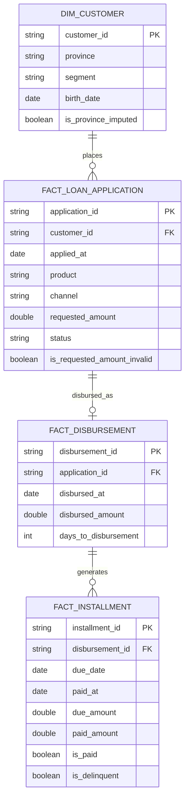

# Credicuotas Data Engineer Challenge

## About Me

Coming from a background where I always worked with Databricks as a managed
cloud service, this was my first time setting up a fully local Docker-based
pipeline from scratch — WSL2, Docker Desktop, and the whole toolchain. For
this entire challenge I paired with Claude Code from the very first step:
setting up WSL2 and Docker Desktop on my own machine, through implementing
and testing each layer of the pipeline. I drove the analytical thinking,
context interpretation, and every business/metric decision myself — Claude
Code was the pair-programming partner that helped me translate those
decisions into working PySpark/SQL code and a solid test suite, while I
focused on the "why" behind each choice. The challenge's criteria and
requirements were very clear, which made it easy to reason about trade-offs
explicitly instead of guessing.

## Introduction & Objective

The goal of this challenge is to build a small but production-minded ELT
pipeline over lending data, following the **medallion architecture**
(bronze → silver → gold), and to surface three business metrics that a
lending operation would actually track.

- **Bronze** — raw ingestion. Every CSV is read as-is (all columns as
  strings, no cleaning, no type casting). The point of bronze is to
  faithfully preserve what arrived, quality issues included, so nothing is
  ever silently lost or "fixed" before it's been looked at.

  *Note on incrementality*: this pipeline currently does a full reload of
  bronze on every run, which is fine at this data volume. In a real,
  growing production setup, if each source table exposed a **primary key**
  plus a **`created_at`/`updated_at`** column, bronze could instead do an
  **incremental upsert** (e.g. a Spark/Delta `MERGE INTO` keyed on the
  primary key, only pulling rows with `updated_at > last_watermark`). That
  would avoid re-reading the entire history on every run and is the natural
  next step once data volume stops fitting comfortably in a full reload.

- **Silver** — cleaning, typing, and conforming. Each table gets its own
  cleaning function (type casting, de-duplication, mixed date-format
  parsing, foreign-key validation). Rows with a broken foreign key are
  **quarantined** — kept in a separate DataFrame, never silently dropped —
  so data loss is always visible and auditable, not swept under the rug.

- **Gold** — a small star-schema-style dimensional model (documented below)
  feeding three business metrics, each computed once and then broken down
  four ways: **total**, **by product**, **by channel**, and **by
  applied-at month** (cohort view), so the metrics can be sliced for
  analysis, not just read as a single flat number.

- **Tests** — 37 automated tests (`make test`): one set of unit tests per
  cleaning function / metric using small, hand-computed synthetic data
  (fast, deterministic, isolates exactly one business rule per test), plus
  2 integration tests that run the full pipeline against the real CSVs and
  pin known totals + structural invariants as regression guards.

- **Final outputs** — 3 CSV files under `output/` (`approval_rate/`,
  `time_to_disbursement/`, `delinquency_rate/`), each with columns
  `segment_type, segment_value, ...counts..., <metric>`, ordered by segment
  for readability.

## Dimensional Model

Bronze/silver preserve the raw tables' grain, but gold needs a model built
around the three metrics. Applications, disbursements, and installments are
three genuinely different business events at three different grains (you
apply once, you may get disbursed once, and you pay in many installments),
so forcing everything into a single wide table would require fan-out joins
that break simple `COUNT`/`AVG` aggregations. Instead, this uses a
**star schema with multiple fact tables** ("galaxy schema") sharing one
conformed dimension:



Design notes on the model:

- **No `dim_date`.** Dates live as native columns on each fact
  (`applied_at`, `disbursed_at`, `due_date`, `paid_at`); month-level
  grouping uses `date_trunc('month', ...)` directly in SQL. At this data
  volume a separate date dimension adds ceremony without adding value — the
  columns are validated in silver, so truncating them directly is safe.
- **`FACT_LOAN_APPLICATION ⟷ FACT_DISBURSEMENT` is 1-to-(0 or 1)**, because
  not every application gets disbursed (`REJECTED` and undecided `PENDING`
  applications never do). Approval Rate only needs
  `FACT_LOAN_APPLICATION`; Time-to-Disbursement needs the join.
- **`fact_loan_application_approved`** is a derived staging view
  (`WHERE status = 'APPROVED'`) — not a persisted dimensional table — built
  specifically to turn that optional 1-to-(0 or 1) relationship into a
  plain inner join for the Time-to-Disbursement metric. This is backed by a
  concrete check against the real data: **100% of non-orphan disbursements
  point at an `APPROVED` application** (verified: 381/381 non-orphan
  disbursements), so pre-filtering to `APPROVED` and inner-joining is
  equivalent to — and simpler than — an outer join followed by a filter.
- **Quarantine, not deletion.** Disbursements with an `application_id` that
  doesn't exist in `fact_loan_application` (5 rows in the real data), and
  installments whose disbursement was itself quarantined (60 rows,
  cascading), are kept in separate `_quarantine_*` DataFrames rather than
  dropped — so a future audit can see exactly what was excluded and why.

## Data Quality Findings (Bronze → Silver)

Profiling the raw CSVs surfaced concrete issues, each handled with an
explicit, documented rule rather than silently discarded:

| Table | Issue found | Rule applied |
|---|---|---|
| `customers` | 12 rows with a null `province` | **Imputed** to `"UNKNOWN"` + flagged (`is_province_imputed`). Dimensions are never dropped for a data-quality reason — losing a customer row would silently break every downstream join. |
| `loan_applications` | 10 exact-duplicate rows | Dropped via `dropDuplicates()` — safe, since it's the same ingestion event repeated. |
| `loan_applications` | 24 rows with null/negative `requested_amount` (23 unique after dedup — one duplicate pair also had a null amount) | **Nulled** the amount + flagged (`is_requested_amount_invalid`), but the **row is kept** — `status`/`product`/`channel` are still valid and needed for Approval Rate regardless of the amount. |
| `disbursements` | 12 of 377 rows had `disbursed_at` in `dd/MM/yyyy` instead of `yyyy-MM-dd` | Parsed with `coalesce(to_date(ISO), to_date(EU))` — both formats resolve, zero rows end up null. |
| `disbursements` | 5 rows with an `application_id` that doesn't exist in `loan_applications` | **Quarantined** (`left_anti` join), not dropped. |
| `installments` | 60 rows whose `disbursement_id` pointed at one of the 5 quarantined disbursements | **Quarantined** in cascade — an installment can't be valid if its parent disbursement isn't. |
| `installments` | 2,757 rows with null `paid_at`/`paid_amount` | **Not an error** — these are installments not yet paid (future or delinquent). Flagged with `is_paid` and used directly in the Delinquency Rate metric. |

## Metrics Analysis

All three metrics are computed as SQL over the temp views registered from
the star schema, and each is broken down 4 ways (`total`, `product`,
`channel`, `applied_month`) via `UNION ALL` of same-shaped sub-queries —
this keeps every segment independently testable and avoids the
NULL-vs-NULL ambiguity of `GROUPING SETS`.

### 1. Approval Rate

**Result: 48.88% (391 / 800 applications)**

The key design decision here is the denominator. `PENDING` applications
**are counted in `total_count`**, alongside `APPROVED` and `REJECTED`. The
reasoning: if `PENDING` were excluded, the Approval Rate of a given month
would keep changing retroactively every time one of its pending
applications finally gets resolved — the same "January 2026" cohort would
report a different rate today than it will report in March, even though
nothing about January's applications actually changed. Counting `PENDING`
in the total makes the metric for a closed period stable and reproducible.
`requested_amount` doesn't participate in this metric at all, so the 23
rows flagged with `is_requested_amount_invalid` don't affect it — this is
exactly why those rows were kept instead of dropped in silver.

Segment highlights: the `PARTNER` channel has the lowest Approval Rate
(38.94%) of all channels, suggesting either a stricter partner-driven
underwriting flow or a riskier applicant pool arriving through that
channel.

### 2. Time-to-Disbursement

**Result: 10.13 days average (372 disbursed loans)**

Computed as `AVG(datediff(disbursed_at, applied_at))`. As covered in the
model section, this metric joins against **`fact_loan_application_approved`**
— a temp view pre-filtered to `status = 'APPROVED'` — instead of joining
against the full `fact_loan_application` and then filtering. Both approaches
produce the same result set (verified: every non-orphan disbursement's
application is `APPROVED`), but pre-filtering turns an optional
1-to-(0 or 1) relationship into a plain inner join, which is simpler to
read and to test than an outer join + null-check.

Segment highlights: `PERSONAL` loans take the longest to disburse (11.09
days) and `TARJETA` the shortest (8.86 days) — worth investigating whether
that gap is product complexity (e.g. more manual review) or an
operational bottleneck.

### 3. Delinquency Rate

**Result: 11.45% (207 / 1,808 installments already due)**

Computed at the **installment grain** (not loan grain): each row is one
scheduled payment. An installment counts in the denominator only if
`due_date <= REFERENCE_DATE` ('2026-01-15') — installments that haven't
come due yet are excluded entirely, from both numerator and denominator,
since it makes no sense to call something "delinquent" before it was even
due. Of the ones already due, an installment is delinquent if:

```sql
paid_at IS NULL OR paid_at > DATE'2026-01-15'
```

i.e. **at the cutoff date itself**, it was still unpaid — whether because
it was never paid, or because it ended up paid only *after* the cutoff.
This is a deliberate snapshot-in-time definition: an installment paid
*late but before* the cutoff is **not** counted as delinquent, because what
the metric is meant to answer is "how much was open and overdue as of this
date", not "did anything in this loan's history ever get paid late".

Segment highlights: `PERSONAL` has both the highest Delinquency Rate
(12.5%) and the slowest Time-to-Disbursement (11.09 days) — the two
metrics point in the same direction for that product. The September 2025
cohort has the worst Delinquency Rate among cohorts with a full repayment
history (16.96%), which would be worth a deeper look.

## Testing Strategy

37 tests total, run with `make test` inside the container:

- **Unit tests per cleaning function / metric** (`tests/test_silver_*.py`,
  `tests/test_gold_*.py`) — each uses a tiny, hand-built synthetic
  DataFrame (2-5 rows) so the expected result can be computed by hand and
  checked exactly. Each test isolates one rule (e.g. "a duplicate id is
  dropped", "a negative amount is nulled but the row is kept", "an
  installment due after the cutoff is excluded").
- **2 integration tests** (`test_silver_integration.py`,
  `test_gold_integration.py`) run the real pipeline against the actual
  `data/*.csv` files and assert both **pinned totals** (e.g. 800 unique
  applications, 391 approved, 1,808 installments due) as a regression
  guard, and **structural invariants** (segment breakdowns must sum back
  to the total) that would catch a broken `GROUP BY` even if the exact
  numbers ever legitimately change.

## How to Run

```bash
make build   # build the image (Python 3.11 + JDK + PySpark 3.5.1)
make test    # run all 37 tests
make run     # bronze -> silver -> gold, writes output/*.csv
make shell   # drop into a shell in the container for ad-hoc exploration
```
